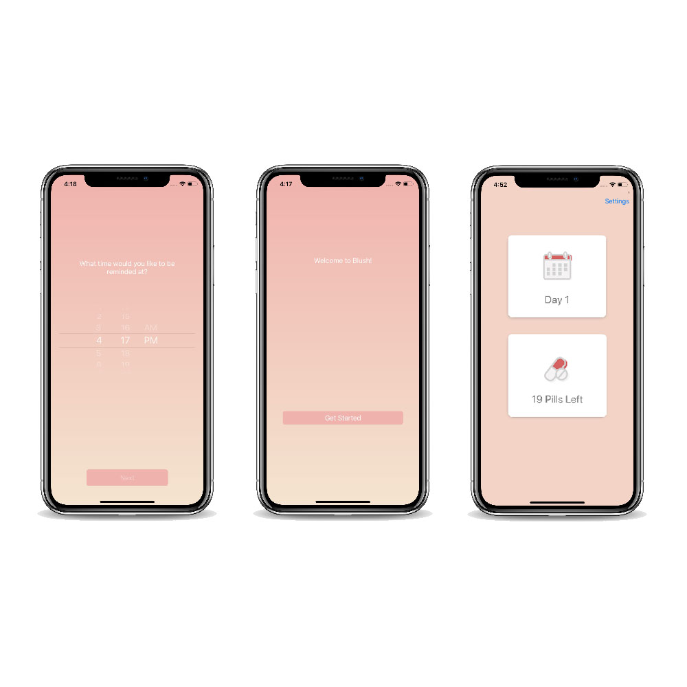

# BlushApp

An application for reminding the user to take their birth control on time. Because not everyone is comfortable with others knowing that they are taking birth control, the user has the flexibility to change what the message of the reminding notification says, in addition to customizing what time they want to be reminded at. Since the user only needs to take 21 pills and rests for 7 days, the app will only send notifications during the 21 pill days. Currently, the apps available on the Apple Store display a giant pack of pills on the home screen on the application. The BlushApp has a generic, simple home screen so the user will not be afraid to open the application in public.

